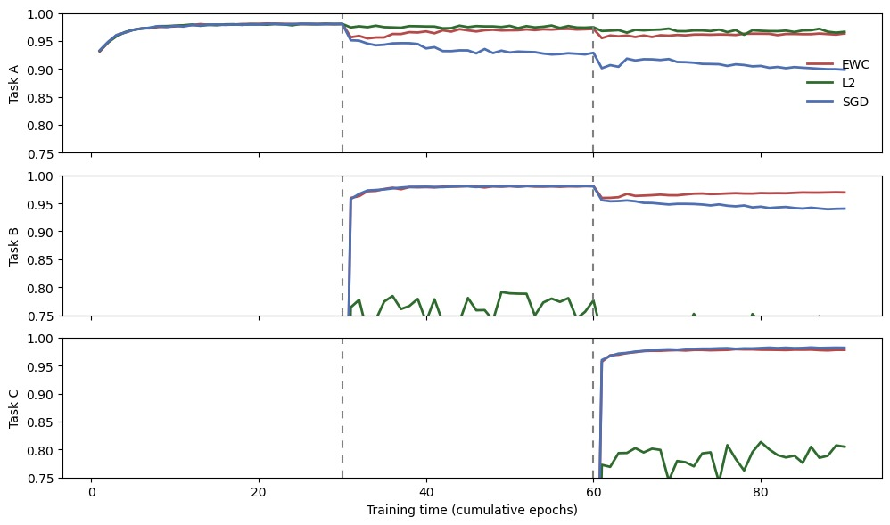
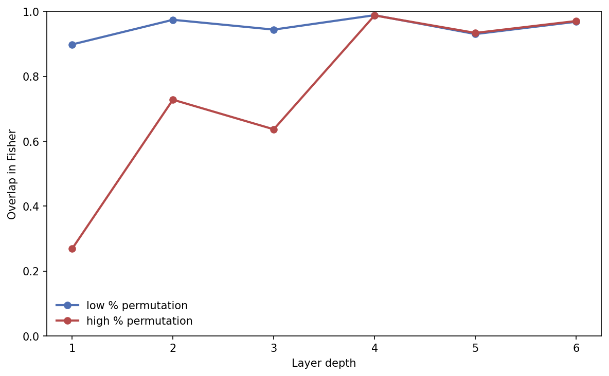
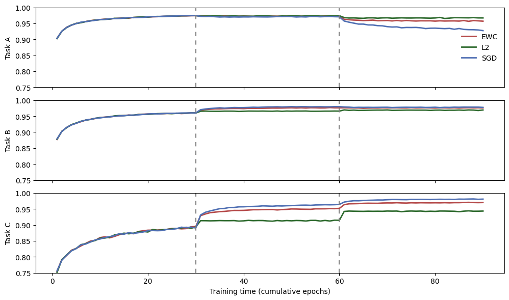
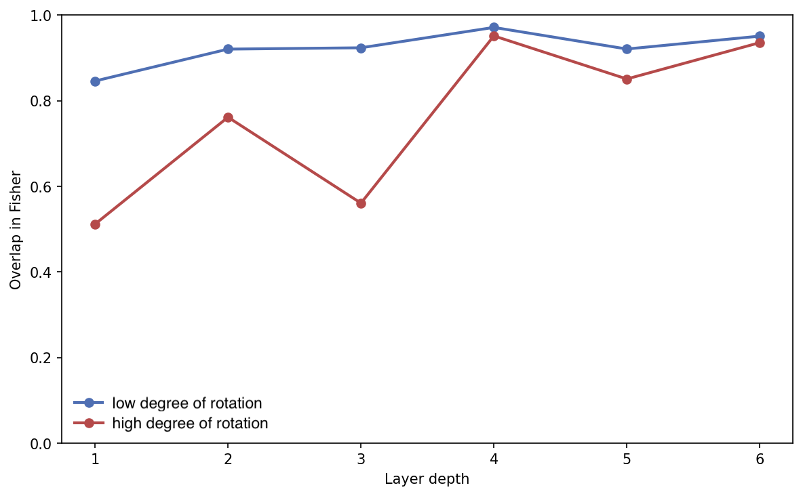

# EE411-Project — Reproducibility Challenge: Overcoming Catastrophic Forgetting in Neural Networks

---

## Team

- **Sofija Orlovic**
- **Jane Klavir**
- **Enric Guasch Mesia**
- **Petar Damjanovic**
- **Marko Stojanovic**

---

## About

This repository contains our work for the **EE411 / Fundamentals of Inference and Learning** reproducibility challenge.

Our goal is to reproduce key results from:

- **Kirkpatrick et al. (2017)**, *Overcoming catastrophic forgetting in neural networks* (EWC)

We study **catastrophic forgetting** in sequential task learning and evaluate how **Elastic Weight Consolidation (EWC)** mitigates forgetting compared to:
- **SGD** (no regularization)
- **L2 regularization**
- **EWC**

We reproduce continual-learning diagnostics on **PermutedMNIST** and **RotatedMNIST**, and include an optional **Atari notebook** used for exploratory / reduced-setting experiments.

---

## Data

We use MNIST in two continual-learning task streams:

- **PermutedMNIST**: each task applies a *fixed random permutation* of pixel indices to all MNIST images for that task.
- **RotatedMNIST**: each task applies a *fixed rotation* to MNIST images (commonly in steps of 10 degrees).

Dataset utilities are implemented in:
- `data.py` (PermutedMNIST task stream)
- `data_rotated.py` (RotatedMNIST task stream)

---

## Installation

Create an environment and install dependencies.

### Option A — `venv`

```bash
python -m venv .venv
# Windows:
.venv\Scripts\activate
# macOS/Linux:
source .venv/bin/activate

pip install -U pip
pip install torch torchvision numpy matplotlib pandas jupyter
```

### Option B — conda

```bash
conda create -n ewc-repro python=3.10 -y
conda activate ewc-repro
pip install torch torchvision numpy matplotlib pandas jupyter
```

---

## Method

We train a single neural network sequentially on tasks (Task 1 → Task 2 → …) and evaluate accuracy on all tasks throughout training to quantify forgetting.

### Baselines

- **SGD**: standard training sequentially across tasks.
- **L2**: adds an L2 penalty on network parameters to discourage large weights.

### Elastic Weight Consolidation (EWC)

EWC adds a quadratic penalty weighted by a diagonal Fisher approximation:

L_total(θ) = L_task(θ) + λ ∑_i F_i (θ_i − θ_i*)²,

where F_i is the estimated Fisher information (importance) for parameter θ_i, θ* are the consolidated parameters from previous tasks, and λ controls the strength of the regularizer.

- `methods/sgd.py` — SGD baseline  
- `methods/l2.py` — L2 regularization baseline  
- `methods/ewc.py` — EWC (Fisher estimation + consolidation + penalty)  

Core experiment/plot logic:
- `experiments.py` — experiment runners / orchestration  
- `model.py` — model architecture  
- `plotting.py` — figure generation helpers  
- `utils.py` — shared utilities  
- `config.py` — configuration (hyperparameters, seeds, paths)  

---

## How To Use

### Recommended: run via notebooks (figure reproduction)

Main entry points:
- `notebooks/run_fig2A_fig2B.ipynb` — Fig. 2A / Fig. 2B-style experiments for PermutedMNIST and RotatedMNIST  
- `notebooks/run_fig2C.ipynb` — Fig. 2C-style diagnostic  
- `notebooks/atari (1).ipynb` — optional Atari exploration (reduced setting)  

Run:

```bash
jupyter notebook
```

---

## Code Structure

```text
EE411-Project/
├── figures/                          # Figures used in the report / README
├── methods/                          # Continual-learning methods (regularizers / training variants)
│   ├── __init__.py
│   ├── ewc.py                        # EWC implementation (Fisher + consolidation + penalty)
│   ├── l2.py                         # L2 regularization baseline
│   └── sgd.py                        # Plain SGD baseline
│
├── notebooks/                        # Reproduction notebooks (main entry points)
│   ├── atari (1).ipynb               # Optional Atari / reduced setting exploration
│   ├── run_fig2A_fig2B.ipynb         # Main notebook: Fig2A/Fig2B-style results
│   └── run_fig2C.ipynb               # Main notebook: Fig2C-style results
│
├── .gitignore
├── README.md
├── __init__.py
├── config.py                         # Central config (hyperparameters, seeds, paths, etc.)
├── data.py                           # PermutedMNIST dataset/task stream utilities
├── data_rotated.py                   # RotatedMNIST dataset/task stream utilities
├── experiments.py                    # Experiment runners / orchestration
├── model.py                          # Model architecture(s)
├── plotting.py                       # Plotting helpers for report figures
└── utils.py                          # General utilities (logging, metrics, helpers)
```

---

## Results

This section mirrors the key diagnostics reported in our write-up. All figures below are stored in the `figures/` folder.

### PermutedMNIST

**Figure 2A-style (sequential training curves).**  
Under plain sequential **SGD**, performance on earlier permutations drops sharply after each task switch (clear catastrophic forgetting). **EWC** mitigates these drops and preserves higher accuracy on previously learned tasks, while **L2** provides only limited protection.



**Figure 2B-style (final performance across tasks).**  
After training on the full stream, EWC retains substantially higher accuracy on earlier tasks than SGD, indicating reduced forgetting.

.jpeg)

**Figure 2C-style (summary diagnostic).**  
The aggregate diagnostic further highlights the gap between SGD and EWC in terms of retention across the task sequence.



### RotatedMNIST

**Figure 2A-style.**  
For rotated tasks, forgetting is typically milder than in PermutedMNIST (tasks share more structure), but EWC still improves stability and retention compared to SGD as the number of tasks grows.



**Figure 2B-style.**  
EWC achieves higher final accuracy across earlier rotations than SGD, indicating improved resistance to forgetting.

.png)

**Figure 2C-style.**  
The summary diagnostic is consistent with the qualitative trend: EWC provides a more robust trade-off between learning new rotations and retaining older ones.



### Optional: Sequential Atari (reduced setting)

We additionally include an exploratory **reduced sequential Atari** setting as a qualitative diagnostic. Due to compute constraints, this is **not** intended as a full-scale quantitative replication of the original Atari protocol.

**Training schedule (reduced setting).**

.png)

**Example result (3 games: SGD vs EWC).**

.png)

---

## Credits

This work was carried out as part of a reproducibility challenge based on:
- **Kirkpatrick et al. (2017)**, *Overcoming catastrophic forgetting in neural networks*.

We acknowledge the authors of the original paper for the method and experimental design that inspired this reproduction effort.

---

## Group contributions

- **Sofija Orlovic** — Lead report writing and coordination of the written deliverable.
- **Jane Klavir** — Implemented and generated the **Figure 2C-style** experiments/plots.
- **Enric Guasch Mesia** — Implemented and generated the **Figure 2A and 2B-style** experiments/plots; contributed to report proofreading and edits.
- **Petar Damjanovic** — Report writing and editing support across sections.
- **Marko Stojanovic** — Explored the **Atari** setup and ran preliminary/reduced-setting experiments.


